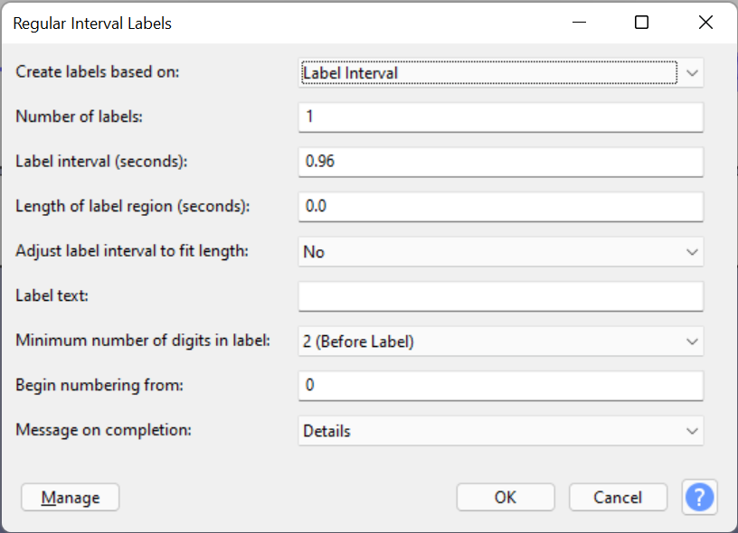
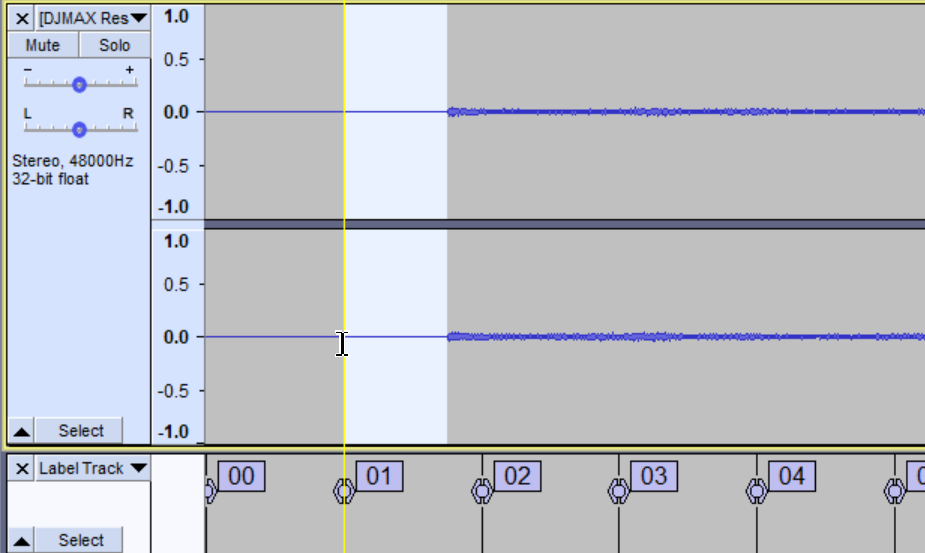
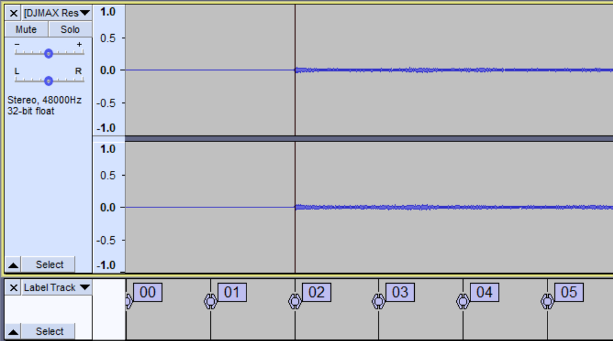

# Audio editing with Audacity

::: warning WARNING!

Before you read this guide, please note:
A few stuffs here are outdated, but you still need to fix the audio offset with this tutorial.

:::

## Requirements

Before we started, you will need:

- [Audacity](https://www.audacityteam.org)
- The music file

## Start editing your audio file

Start by importing your music to Audacity. You can easily do so by drag and drop your music to Audacity. For this guide, we'll *Marry Me, Nightmare* by t+pazolite.

As you can see, the music starts at 0.250 seconds. Because it's below 0.9 seconds so we need to put fix that.

Press Home to make Audacity's scanner bar move to the leftmost. Then Generate → Silence. Set Duration to 0.900

Then you have something like this:

Click anywhere to deselect. Now go to Tools --> Regular Interval Labels

You'll get a window like this:

{}

Set the time to place the first label to 0

Set Label Interval to ${\frac{120}{BPM}}$. The $BPM$ here is the starting BPM of your song file.

In this case, the song starts with 250 BPM, so the value is:
$$
{\frac{120}{250}}=0.48
$$
Then do this set of things:

1. Label Text (optional, empty it if you want)

2. Minimum Digit Number is set to 1 or 2 (for easier reading).

3. Set begin numbering from 0.

4. Adjust label interval to fit length must be set to No.

Here is our config for this example:

{.side-img}

Click OK. Our result is like this:

As you can see, it starts in the middle between the label *2* and *3*. To zero the offset in chart editors, you must be sure the music beat start on the label.

::: tip NOTE

We recommend you syncing the labels that are an even number (or an odd number if you're using 1 as the begin numbering) because of how syncing works in both BPM changing and Page editing

:::

There are two approaches, either edit the music to start at Label 2 or start at 3.

So either delete some silence (approach 1) or generate more silence (approach 2). This is dependent on your existing chart.

To do approach 1, simply from starting music, left click and drag until it selects to label 2, then press **Delete**.

And for the second approach, zoom in to label 0 and label 1, drag from the start of the music, to label 1. And make sure to set Selection to Length rather than End.

It will show the duration needed to generate silence. This happens to be 0.301. Note it.

Deselect your selection, Press Home, go to Generate --> Silence, and enter the value shown earlier.

Now the music starts at Label 3. And you can test play this with scanline shift 0. If the scanline rebounds in line with the beat, you've done right.
