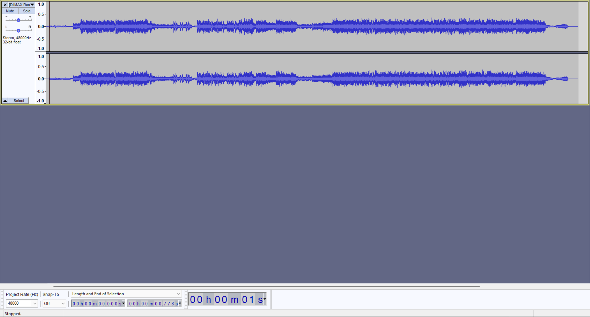
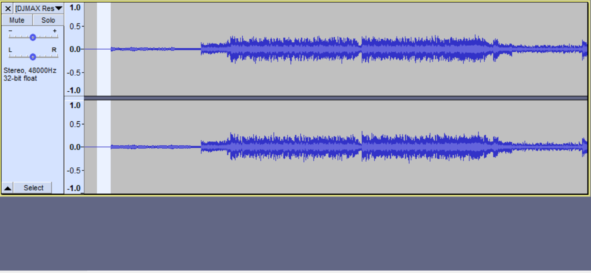

# Audio editing

Cytoid supports the music offset. However, you still should set it to "0" because we can maximize the compatibility with chart editors. Moreover, if your song starts before 0.9 seconds, this might be a big problem in your chart. That's why you should edit the audio file(s) before charting.

## You might need

An audio editor - we will use Audacity in this article.
The audio file of the song you want to chart.

## Editing your audio file(s)

### Importing the file into Audacity

You can go to File --> Import --> Audio or use "drag and drop" method.

### Editing your audio file(s)

:::tip TIP
We will use "Marry me, Nightmare" by t+pazolite as an example for this article.
:::

Now, look at the waveform.

You can see that the music starts at around 0.250 seconds, that's below 0.9 seconds, we need to fix it.

Our result will look like this:

Next, double-click or Ctrl + A on your keyboard and go to Tools --> Regular Interval Labels..., you can see this dialog:

{.side-img}

Set:
- *Create labels based on* to *Label Interval*
- *Number of labels* to a random number (don't set it too big!)
- *Label interval (seconds):* to ${120 \div BPM}$ (in this example, it starts with 250 BPM, so ${120\div 250 = 0.48)
- "Adjust label interval to fit length:" to No
- "Begining numbering from:" to 0

Here is our configuration for this example:

{.side-img}

Click OK and finished!

As you can see, the music starts around between the label 2 and 3. To zero the offset, you will have to make sure that the music begins on the label.

::: tip NOTE

We recommend you syncing the labels that are an even number (or an odd number if you're using 1 as the begin numbering) because of how syncing works in both BPM changing and Page editing

:::

There are two approaches, either edit the music to start at Label 2 or start at 3. So either delete some silence (approach 1) or generate more silence (approach 2). This is dependent on your existing chart.

To do approach 1, simply from starting music, left click and drag until it selects to label 2, then press **Delete**.

And for the second approach, zoom in to label 0 and label 1, drag from the start of the music, to label 1. And make sure to set Selection to Length rather than End.

It will show the duration needed to generate silence. This happens to be 0.301. Note it.

Deselect your selection, Press Home, go to Generate --> Silence, and enter the value shown earlier.

Now the music starts at Label 3. And you can test play this with scanline shift 0. If the scanline rebounds in line with the beat, you've done right.

Congratulations! You've learned how to edit an audio file. Now, you should try editing your audio file and start charting!
